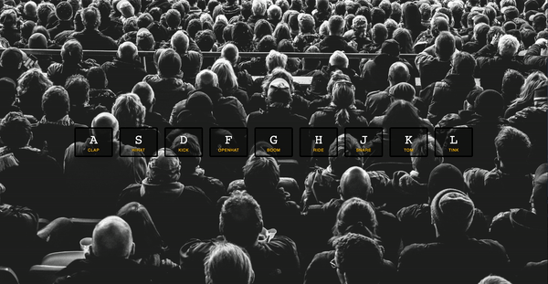

# 01 Javascript Drumk Kit
Project #1 of [30 Day Vanilla JS Coding Challenge](https://javascript30.com)

Basic Javascript Drum Kit

## Lessons learned
- Key events
- Playing audio
- Listening to a transtionend event (animations)

