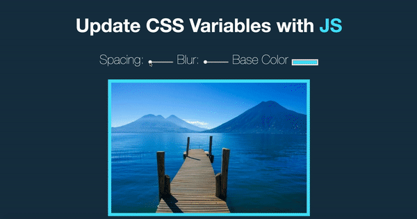

# 03 CSS Variables
Project #03 of [30 Day Vanilla JS Coding Challenge](https://javascript30.com)

## Lessons learned
- CSS variables updated with Javascript.
- When a variable in CSS is updated, everywhere on the page that that variable is referenced will update itself.

