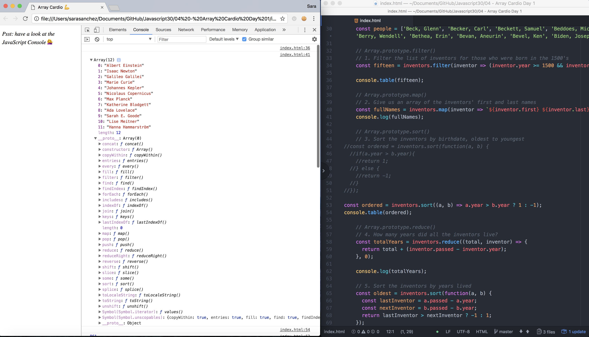

# 04 Array Cardio Day 1
Project #04 of [30 Day Vanilla JS Coding Challenge](https://javascript30.com)

## Lessons learned
- Fundamentals of Javascript
- Practice of array methods (filter, map, sort, reduce…)

