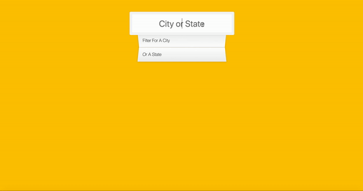

# 06 Ajax Type Ahead
Project #06 of [30 Day Vanilla JS Coding Challenge](https://javascript30.com)

## Lessons learned
- Create a type ahead feature
- Sort, list, filter data by cities, states and population

