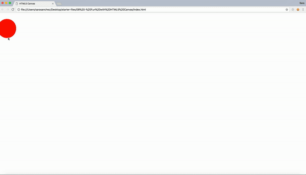
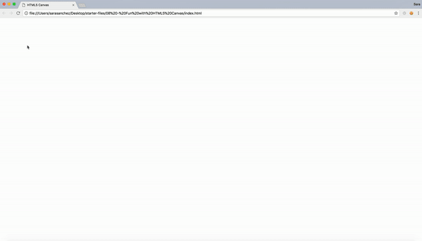
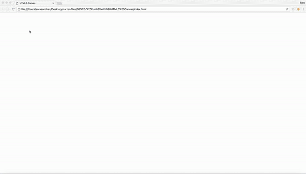

# 08 Fun with HTML5 Canvas

Project #08 of [30 Day Vanilla JS Coding Challenge](https://javascript30.com)

## Lessons learned

-   Built HTML 5 Canvas (click down, drag finger and let go to draw)
-   How the fundamentals of HTML Canvas work

