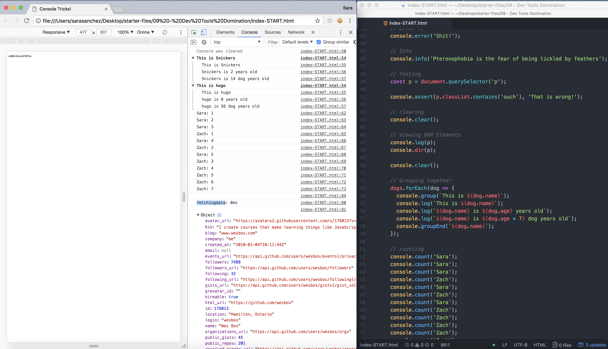

# 09 Dev Tools Domination
Project #09 of [30 Day Vanilla JS Coding Challenge](https://javascript30.com)

## Lessons learned
- Practices: Regular, Interpolated, Styled, warning, Error, Info, Testing, Clearing, Viewing DOM Elements, Grouping together, Counting, Timing 

