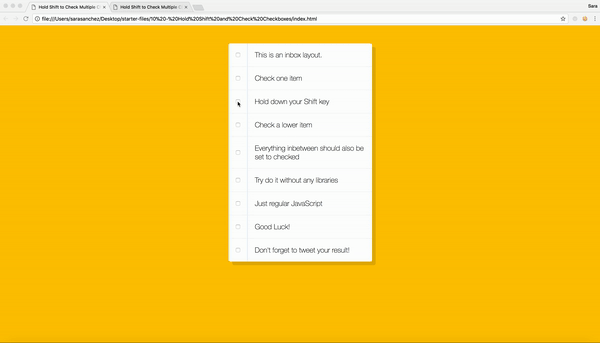

# 10 Hold Shift and Check Checkboxes
Project #10 of [30 Day Vanilla JS Coding Challenge](https://javascript30.com)

## Lessons learned
Click a checkbox - hold down shift key - click another checkbox and all the checkboxes in between the first and second one chosen will then be checked (from top to bottom, from bottom to top).

