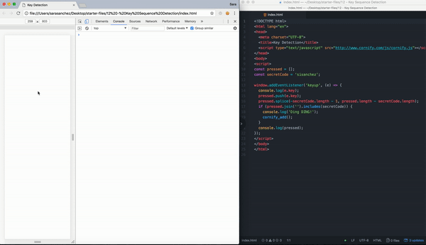

# 12 Key Sequence Detection
Project #12 of [30 Day Vanilla JS Coding Challenge](https://javascript30.com)

## Lessons learned
- Basics of getting up a key sequencing detection (store them in an array and check every time if it matches what you're looking)

