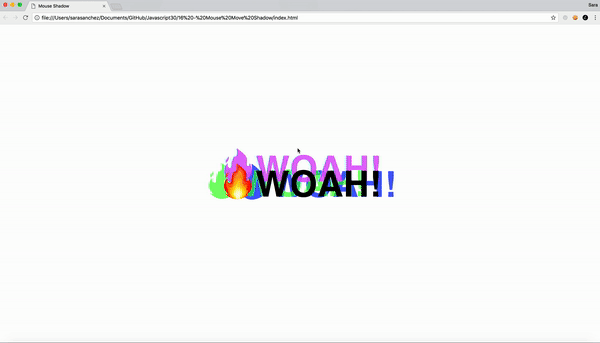

# 16 Mouse move shadow
Project #16 of [30 Day Vanilla JS Coding Challenge](https://javascript30.com)

## Lessons learned
- Move cursor on the window and shadow will follow around depending on where the mouse is 

