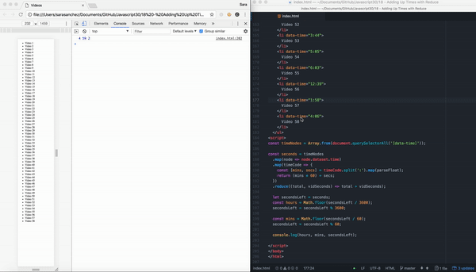

# 18 Adding Up Times With Reduce
Project #18 of [30 Day Vanilla JS Coding Challenge](https://javascript30.com)

## Lessons learned
- Add up total number of minutes, seconds and hours of videos using Reduce

